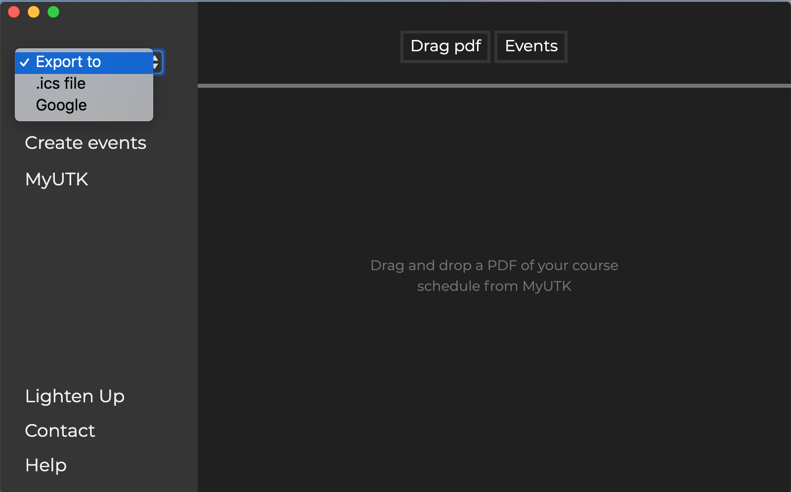

# CourseCal
A simple application that automates adding The University of Tennessee's course schedule to a digital calendar. If you have Electron and NodeJS, you can easily run this app by cloning this repository onto your machine, opening up a terminal, navigating to the directory, running the command ```npm install```, and then the command ```npm start```.

<p float="center">
  
</p>

To use the application, first simply download your course schedule as a PDF from <a href="my.utk.edu">MyUTK</a>. Once you have it on your computer, spin up the application, and drag the PDF over from your desktop to the drop area. If it's not on your desktop, you can use the built in file browswer by selecting ```Semester +```. It will then confirm that it recieved your schedule.

<p float="left">
  
  
</p>

To push it to your preferred calendar, toggle the dropdown menu, and select either ```.ics file``` or ```Google```. Google will promt you to login and authorize the application. The other just creates a general ICS file that you can use with most digital calendars.

<p float="left">
  
  
</p>

That's it, you're done!
